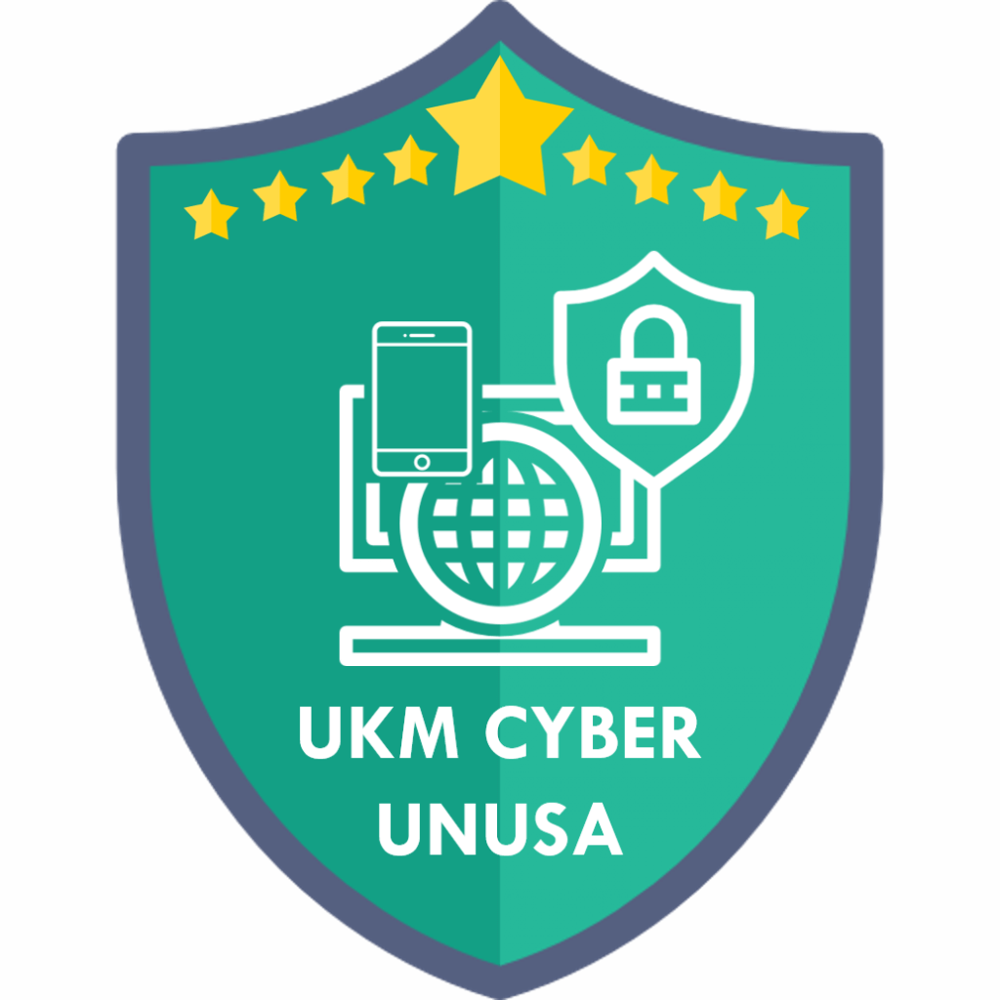

# UKM Cyber UNUSA - Website Company Profile

<p align="center">
  
</p>

Selamat datang di repositori untuk website profil UKM Cyber Computer Security Universitas Nahdlatul Ulama Surabaya (UNUSA) versi 2.0. Proyek ini dibangun untuk menampilkan informasi, kegiatan, dan layanan yang ditawarkan oleh UKM Cyber UNUSA. Website ini menyediakan platform digital untuk mengelola anggota, kegiatan, dokumentasi, dan berbagai fitur interaktif lainnya.

## Tautan Produksi

Anda dapat mengakses versi _live_ dari website ini di:
[cyber-unusa.netlify.app](https://cyber-unusa.netlify.app)

## Fitur Utama

- **Dashboard Admin**: Kelola pengguna, anggota, dan konten website.
- **Manajemen Anggota**: Sistem pendaftaran dan pengelolaan anggota UKM.
- **Sistem Presensi**: Tracking kehadiran pada kegiatan.
- **Dokumenter**: Platform untuk mengunggah dan mengelola dokumentasi kegiatan.
- **AI Chat Widget**: Asisten virtual untuk membantu pengguna.
- **Marketplace Produk**: Platform jual beli produk digital dan merchandise.
- **Sistem Autentikasi**: Login, registrasi, dan verifikasi email dengan OTP.
- **Responsive Design**: Antarmuka yang responsif untuk desktop dan mobile.

## Teknologi yang Digunakan

Proyek ini dibagi menjadi dua bagian utama: _client_ (frontend) dan _server_ (backend).

- **Client (Frontend):**
  - **React:** Pustaka JavaScript untuk membangun antarmuka pengguna.
  - **Vite:** _Build tool_ modern untuk pengembangan frontend yang cepat.
  - **Tailwind CSS:** Kerangka kerja CSS _utility-first_ untuk desain yang cepat dan responsif.
  - **Axios:** Klien HTTP berbasis _promise_ untuk membuat permintaan ke backend.
  - **React Router:** Untuk _routing_ di sisi klien.
  - **ESLint:** Untuk linting kode JavaScript.

- **Server (Backend):**
  - **Node.js:** Lingkungan eksekusi JavaScript sisi server.
  - **Express:** Kerangka kerja aplikasi web minimalis untuk Node.js.
  - **MongoDB:** Basis data NoSQL berbasis dokumen.
  - **Mongoose:** Pustaka ODM (Object Data Modeling) untuk MongoDB dan Node.js.
  - **JWT (JSON Web Tokens):** Untuk autentikasi pengguna.
  - **Bcryptjs:** Untuk _hashing_ kata sandi.
  - **Nodemailer:** Untuk mengirim email (misalnya, verifikasi OTP).
  - **Multer:** _Middleware_ untuk menangani unggahan berkas `multipart/form-data`.
  - **Cloudinary:** Untuk penyimpanan dan pengelolaan gambar (jika digunakan).

## Schema Database

<p align="center">
  
</p>

## Memulai Pengembangan Lokal

Ikuti langkah-langkah ini untuk menjalankan proyek secara lokal di mesin Anda.

### Prasyarat

- Node.js (versi yang disarankan sesuai dengan `engines` di `server/package.json`)
- npm atau yarn
- MongoDB (lokal atau layanan _cloud_ seperti MongoDB Atlas)

### Langkah Instalasi

1.  **Klon Repositori:**

    ```bash
    git clone https://github.com/cyber-unusa/cyber-unusa.git
    cd cyber-unusa
    ```

2.  **Siapkan Backend:**
    - Masuk ke direktori _server_:
      ```bash
      cd server
      ```
    - Instal dependensi:
      ```bash
      npm install
      # atau
      yarn install
      ```
    - Buat berkas `.env` dari `env.sample`:
      ```bash
      cp .env.sample .env
      ```
    - Isi variabel lingkungan di berkas `.env` dengan nilai yang sesuai:
      - `MONGODB_URL`: URL koneksi MongoDB Anda.
      - `JWT_SECRET`: Kunci rahasia acak untuk menandatangani token JWT.
      - `NODE_ENV`: Setel ke `development`.
      - `SMTP_USER`, `SMTP_PASS`: Kredensial akun SMTP Anda.
      - `SENDER_EMAIL`: Alamat email pengirim.
    - Jalankan server pengembangan:
      ```bash
      npm run server
      # atau
      yarn server
      ```
      Server akan berjalan di `http://localhost:4000` (atau _port_ lain jika dikonfigurasi).

3.  **Siapkan Frontend:**
    - Buka terminal baru dan masuk ke direktori _client_:
      ```bash
      cd ../client
      # atau dari root:
      cd client
      ```
    - Instal dependensi:
      ```bash
      npm install
      # atau
      yarn install
      ```
    - Buat berkas `.env` dari `.env.sample`:
      ```bash
      cp .env.sample .env
      ```
    - Isi variabel lingkungan di berkas `.env`:
      - `VITE_BACKEND_URL`: Setel ke URL backend Anda (misalnya `http://localhost:4000`).
    - Jalankan server pengembangan frontend:
      ```bash
      npm run dev
      # atau
      yarn dev
      ```
      Aplikasi frontend akan tersedia di URL yang ditampilkan oleh Vite (biasanya `http://localhost:5173`).

## Deployment

Proyek ini dikonfigurasi untuk deployment otomatis ke Netlify. Berkas `netlify.toml` berisi konfigurasi deployment.

- **Frontend**: Dideploy secara otomatis dari direktori `client/` saat push ke branch utama.
- **Backend**: Menggunakan Vercel untuk deployment serverless API (lihat `vercel.json`).

## Struktur Proyek

```
cyber-unusa/
├── client/                 # Frontend React + Vite
│   ├── public/            # Static assets
│   ├── src/
│   │   ├── components/    # Reusable components
│   │   ├── pages/         # Page components
│   │   ├── services/      # API services
│   │   └── ...
│   └── package.json
├── server/                 # Backend Node.js + Express
│   ├── api/               # API entry point
│   ├── controllers/       # Route controllers
│   ├── models/            # MongoDB models
│   ├── routes/            # API routes
│   └── package.json
├── asset/                  # Shared assets
├── netlify.toml           # Netlify config
└── README.md
```

## Alur Kerja Kontribusi

Kami menyambut kontribusi untuk meningkatkan proyek ini. Ikuti langkah-langkah berikut:

1.  **Buat Cabang Baru (_Branch_):**
    Buat cabang baru dari `main` (atau cabang pengembangan utama) untuk setiap fitur atau perbaikan. Gunakan nama cabang yang deskriptif.

    ```bash
    git checkout -b <tipe>/<nama-fitur-atau-perbaikan>
    # Contoh: git checkout -b feature/user-profile
    # Contoh: git checkout -b fix/login-validation-bug
    ```

2.  **Lakukan Perubahan:**
    Buat perubahan kode Anda di cabang baru ini.

3.  **Tambahkan dan _Commit_ Perubahan:**
    Tambahkan berkas yang diubah ke _staging area_ dan lakukan _commit_ dengan pesan yang jelas mengikuti konvensi _commit_ (misalnya, _Conventional Commits_).

    ```bash
    git add .
    git commit -m "<tipe>: <deskripsi singkat perubahan>"
    # Contoh: git commit -m "feat: Menambahkan halaman profil pengguna"
    # Contoh: git commit -m "fix: Memperbaiki validasi email pada form login"
    ```

4.  **Dorong (_Push_) Cabang:**
    Dorong cabang Anda ke repositori _remote_.

    ```bash
    git push -u origin <nama-cabang-anda>
    ```

5.  **Buat _Pull Request_ (PR):**
    Buka _Pull Request_ di GitHub dari cabang Anda ke cabang `main` (atau cabang pengembangan utama). Jelaskan perubahan yang Anda buat dan mengapa perubahan itu diperlukan.

### Catatan Tambahan

- Untuk perubahan besar, disarankan untuk membuka _issue_ terlebih dahulu untuk mendiskusikan rencana perubahan atau penambahan fitur.
- Pastikan untuk memperbarui dokumentasi atau pengujian jika diperlukan.
- Lihat `TODO.md` di direktori `client/` dan `server/` untuk fitur yang sedang dalam pengembangan.

Terima kasih telah berkontribusi! 🚀

## Lisensi

Proyek ini menggunakan lisensi [MIT](LICENSE).
